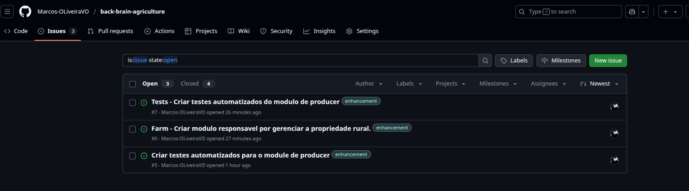
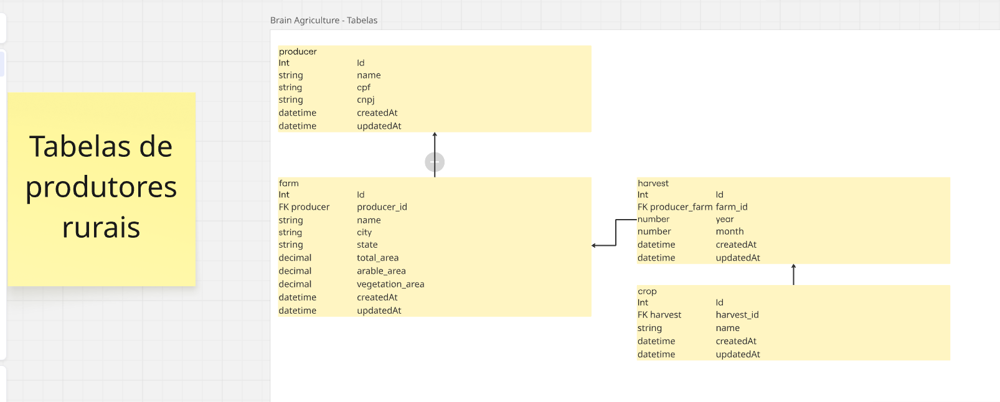
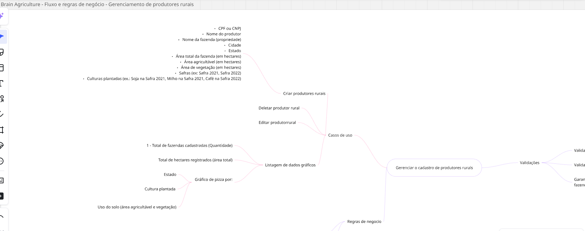

## Descrição

Repositório referente ao projeto Brain Agriculture.
Todo o projeto pode ser executado localmente utilizando Docker + Docker Compose.

Optei por utilizar conceitos de Arquitetura Limpa e DDD, como desenvolvimento orientado a entidades e regras de negócio bem definidas. O projeto segue firmemente o conceito de modularização.

Cada módulo é responsável por suas funcionalidades e é isolado dos demais. Deseja adicionar uma nova funcionalidade em producer? Você só precisa alterar o próprio módulo de producer.

## Importante

A descrição do desafio era um pouco ambígua.
O que deu a entender foi que seria necessário um único endpoint com o seguinte JSON:

```json
CPF ou CNPJ
Nome do produtor
Nome da fazenda (propriedade)
Cidade
Estado
Área total da fazenda (em hectares)
Área agricultável (em hectares)
Área de vegetação (em hectares)
Safras (ex: Safra 2021, Safra 2022)
Culturas plantadas (ex.: Soja na Safra 2021, Milho na Safra 2021, Café na Safra 2022)
```

No entanto, optei por uma abordagem modularizada. Assim, o fluxo segue a seguinte ordem:

- 1 - Criar o produtor
- 2 - Criar a propriedade rural do produtor
- 3 - Criar a safra (uma propriedade pode ter várias safras)
- 4 - Criar as culturas plantadas (uma safra pode ter várias culturas)

Com essa estrutura, o projeto é totalmente escalável. Como dito anteriormente, se você deseja adicionar a funcionalidade "X" no módulo "Y", os demais módulos não precisam saber da implementação.

## Estrutura de Pastas dos Módulos

```
└── NomeDoMódulo
    └── application
        └── entities
        └── use-cases
        └── interfaces
    └── infra
        └── database
            └── repositories
        └── http
            └── controllers
            └── viewModels
        └── adapters
            └── dtos
            └── mappers
    └── tests
        └── e2e
        └── inMemoryRepository
        └── unit
        └── mockData
```

**Todas as funcionalidades foram separadas em suas respectivas issues e branches, de forma organizada.**


## Demais Funcionalidades implementadas:

- 1 - **Swagger** - Integração com swagger para documentação da api e rotas.
- 2 - **Docker** - Integração com docker rodando em ambiente local
- 3 - **PostgreSQL** - Utilização do banco de dados postgresql
- 4 - **ORM** - Utilização do ORM prisma
- 5 - **Testes** - Criação de testes automatizados (integração e unitario)
- 6 - **Dados Mockados** - Uso de dados mockados para os testes.

## Tabelas planejadas no miro e implementadas:



## Fluxo de regras de negocios e casos de uso que planejei no miro:



## Setup do projeto

Execute o seguinte comando para instalar as dependências:

```bash
$ yarn
```

## Rodando o projeto

```bash
$ yarn start
```

## Rodando os testes automatizados

```bash
# testes unitarios
$ yarn test:unit

# testes e2e
$ yarn run test:e2e

# coverage dos testes
$ yarn run test:cov
```

## Miro

Antes de escrever qualquer linha de código, parei para planejar a aplicação no Miro, ferramenta que costumo usar para estruturar funcionalidades e fluxos de forma visual.

O link pode ser encontrado aqui: [Miro](https://miro.com/welcomeonboard/UTJlK0NlOE4vUWtyTTl6NmFIaVdmb0djY3gyUllrMW9SQzhBVkdZemhsZWs4T0o1QXRkMzdndEhnNnVTYmhqZTV6ckJ3eW9HNUxYU0ZWL3ZneFhBd2xMbWY1OXI3SFkwS253YlF4VDZtN0NTblN3cHpiMUxDZzhzRmVjbFd4YldyVmtkMG5hNDA3dVlncnBvRVB2ZXBnPT0hdjE=?share_link_id=258833236902)

## Autor do projeto

- Author - [Marcos Oliveira](https://www.linkedin.com/in/marcos-oliveiraaa/)
